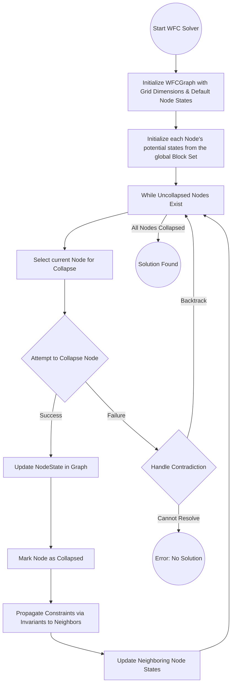
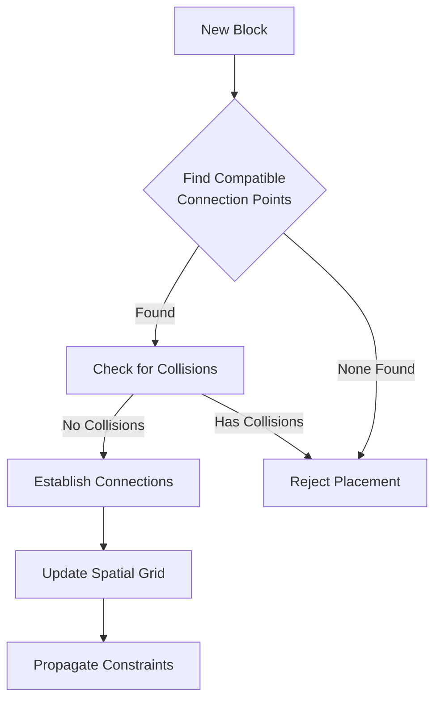

# Block3D Algorithm Crate

This crate provides algorithms for procedural generation and manipulation of 3D block structures, with a primary focus on a Wave Function Collapse (WFC) implementation.

## Wave Function Collapse (WFC)

Wave Function Collapse is a procedural generation algorithm that creates complex patterns from a small set of input modules (blocks) by iteratively reducing entropy in a grid. Each cell in the grid starts in a "superposition" of all possible states (blocks and orientations) and collapses to a single definite state based on local constraints and heuristics.

### Core Concepts

*   **Grid/Graph (`WFCGraph`)**: A structure (typically a 3D grid) where each cell (node) will eventually hold a specific block.
*   **Node State (`NodeState`)**: Represents the state of a cell. Initially, it's a superposition of all possible blocks and their orientations. During collapse, it's reduced to a single chosen block and orientation. It also stores the cell's 3D `position`.
*   **Collapse**: The process of choosing a single definite state for a node from its current possible states.
*   **Propagation**: Once a node is collapsed, constraints derived from this choice are propagated to neighboring nodes, reducing their possible states.
*   **Heuristics (`Heuristic` trait)**: Strategies used to guide the WFC process:
    *   **Node Selection**: Deciding which node to collapse next (typically the one with the lowest "entropy" - fewest possible states).
    *   **State Selection**: Deciding which specific block/orientation to choose for a collapsing node from its valid possibilities.
*   **Invariants (`WFCInvariant` trait)**: Global or local rules that must always be satisfied by the arrangement of blocks. These rules help prune the search space and ensure valid configurations. Example: `GravityInvariant`.
*   **Compatibility Rules (`CompatibilityRule`)**: Specific rules defining how different block types or faces can be placed adjacent to each other. These are managed by a `CompatibilityTable` within the solver. Example: `lego_connectivity`.

### Algorithm Flow

The WFC algorithm generally follows these steps:



### Key Structures

*   **`WFCGraph<T: Block3DLike>`**:
    *   Defined in `src/wfc/graph.rs`.
    *   A wrapper around a `petgraph::Graph` representing the grid.
    *   Nodes store `NodeState<T>`, edges are `EdgeState`.
    *   Provides `grid_graph()` to initialize a 3D grid structure where each node knows its `(x,y,z)` position.

*   **`NodeState<T: Block3DLike>`**:
    *   Defined in `src/wfc/solver/state.rs`.
    *   Contains the chosen `block: T`, its `orientation: Orientation`, and its `position: (usize, usize, usize)`.
    *   Initially, blocks are default and represent a superposition of possibilities.

*   **`WFCSolver<T: Block3DLike>`**:
    *   Defined in `src/wfc/solver/mod.rs`.
    *   The main engine for the WFC algorithm.
    *   Manages the `WFCGraph`, the set of available `block_set`, `invariants`, `compatibility` rules, and the chosen `heuristic`.
    *   `solve()`: Attempts to find a complete solution for the graph.
    *   `collapse_node()`: The core logic for collapsing a single node, including:
        1.  Generating possible states for the node from the `block_set`.
        2.  Filtering these states using registered `invariants`.
        3.  Using the `heuristic` to select a single state.
        4.  Updating the node in the graph.
        5.  Propagating changes to neighbors (also guided by invariants).
    *   `collapse_specific_node()`: Allows collapsing a targeted node, useful for interactive scenarios.

*   **`Heuristic<T>` Trait**:
    *   Defined in `src/wfc/heuristics/mod.rs`.
    *   `select_node_to_collapse()`: Chooses the next node to process.
    *   `select_state_for_node()`: Chooses a specific block and orientation for the selected node.
    *   **`WeightedRandomHeuristic`**: An example implementation (in `src/wfc/heuristics/weighted_random_heuristic.rs`) that selects the node with the minimum entropy and then randomly picks a state, potentially with weighting based on `BlockKind`.

*   **`WFCInvariant<T>` Trait**:
    *   Defined in `src/wfc/invariants/mod.rs`.
    *   `check()`: Verifies if a given state for a node is valid according to the invariant.
    *   `propagate()`: Determines which neighboring nodes are affected by a collapse and need re-evaluation.
    *   **`GravityInvariant`**: An example (in `src/wfc/invariants/gravity_invariant.rs`) ensuring blocks are supported (rudimentary implementation based on node indices for relative positions).

*   **`CompatibilityRule<T>` and `CompatibilityTable<T>`**:
    *   Defined in `src/wfc/solver/compatibility.rs`.
    *   Allows defining specific adjacency rules between blocks.
    *   `CompatibilityRule::lego_connectivity()`: An example rule checking for basic stud/tube compatibility between Lego blocks.
    *   The `WFCSolver` contains a `CompatibilityTable` where such rules can be added. These rules are then checked by the `is_compatible` method, which the solver would typically use when evaluating neighbor constraints during propagation (though the current `collapse_node` doesn't explicitly show this step, it's implied in a full propagation logic).

### Usage Example

To use the WFC solver, you typically:
1.  Create a `WFCGraph` (e.g., `WFCGraph::grid_graph(dimensions)`).
2.  Define a `HashSet<Block3D>` representing your available block modules.
3.  Instantiate any `WFCInvariant`s or `CompatibilityRule`s you want to apply.
4.  Choose a `Heuristic`.
5.  Create the `WFCSolver`:
    ```rust
    use block3d_algorithm::wfc::{
        graph::WFCGraph,
        solver::WFCSolver,
        heuristics::weighted_random_heuristic::WeightedRandomHeuristic,
        // ... import your invariants and rules
    };
    use block3d_core::block::{Block3D, lego_block::LegoBlock, BlockKind}; // and other necessary types
    use std::collections::HashSet;

    // Example setup
    let dimensions = (5, 5, 5);
    let mut block_set = HashSet::<Block3D>::new();
    // Populate block_set with LegoBlock instances...
    // e.g., block_set.insert(Block3D::Lego(LegoBlock::new((1,1,1), BlockKind::Wall, vec![])));

    let graph = WFCGraph::<Block3D>::grid_graph(dimensions);
    let heuristic = Box::new(WeightedRandomHeuristic);
    
    // Initialize invariants and compatibility rules (examples)
    // let invariants: Vec<Box<dyn WFCInvariant<Block3D>>> = vec![Box::new(GravityInvariant)];
    // let mut compatibility_table = CompatibilityTable::new();
    // compatibility_table.add_rule(CompatibilityRule::lego_connectivity());
    // Note: The solver currently takes invariants directly. Compatibility rules would be added to solver.compatibility.

    let mut solver = WFCSolver::new(
        graph,
        block_set,
        vec![], // Pass your invariants here
        heuristic,
        vec![]  // Observers
    );
    // If using compatibility rules, add them to solver.compatibility

    match solver.solve() {
        Ok(()) => {
            println!("Solution found!");
            // Access the solved graph: solver.graph
            // println!("{}", solver.graph.pretty_print());
        }
        Err(e) => println!("WFC Error: {:?}", e),
    }
    ```
    Refer to the `crates/block3d_algorithm/src/bin/lego_wfc.rs` binary for a runnable example (though it might be very basic).

### Current Features & Potential Enhancements

*   **Grid-based WFC**: Supports 3D grid graphs.
*   **Position Tracking**: Nodes store their explicit `(x,y,z)` coordinates.
*   **Basic Heuristics**: Includes a `WeightedRandomHeuristic`.
*   **Invariant System**: Supports custom invariants (`GravityInvariant` as an example).
*   **Compatibility Rules**: System for defining adjacency constraints.
*   **Targeted Collapse**: `collapse_specific_node` allows for interactive WFC.
*   **Rudimentary Backtracking**: The solver includes a basic backtracking mechanism in `solve()`.
*   **Connection-Based Approach**: Handles different sized blocks through connection points rather than grid cells.
*   **Spatial Partitioning**: Uses a spatial grid for efficient collision detection between blocks.

Potential areas for future enhancements:
*   More sophisticated heuristics (e.g., considering connection points, structural stability).
*   Advanced backtracking strategies.
*   More complex and robust invariants and compatibility rules (e.g., detailed face/connector matching).
*   Performance optimizations for larger grids.

## Connection-Based Block Placement

To handle blocks of different sizes, we use a connection-based approach rather than a strict grid-based method. This approach is particularly suitable for LEGO-style blocks where connections occur at specific points (studs, tubes) rather than entire faces.

### Key Components

1. **Connection Points**:
   - Each block defines connection points in its local space
   - Each connection has:
     - An interface type (stud, tube, etc.)
     - A position offset from the block's origin
     - An orientation
     - Reference to connected blocks

2. **Spatial Awareness**:
   - A spatial grid accelerates collision detection
   - Blocks register their volume in the grid
   - Quick filtering of potential collisions

3. **Connection Process**:
   - When placing a block:
     1. Find compatible connections on existing blocks (e.g., stud→tube)
     2. Position the new block based on connection alignment
     3. Verify no collisions with other placed blocks
     4. Establish bidirectional connection references

### Benefits

- Naturally handles blocks of different sizes
- Creates structurally sound arrangements
- Mimics real building block behavior
- Avoids grid alignment issues
- Allows precise positioning based on connection geometry



This approach ensures that blocks can only be placed where they physically connect to the existing structure while properly handling their actual geometric volumes.