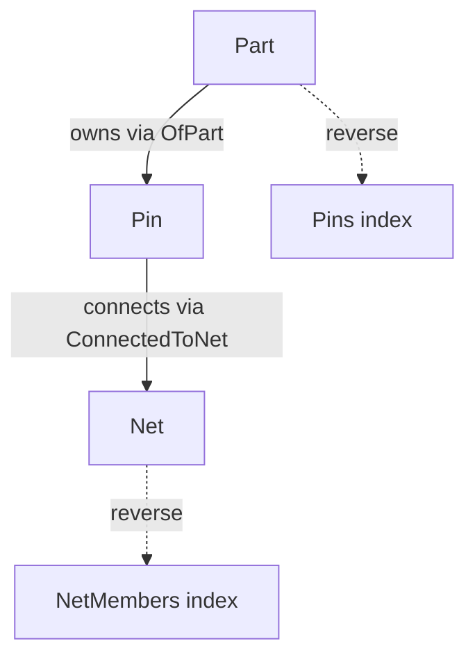

## Hypergraph Circuit Model

This document clarifies naming and relationships used in the hypergraph circuit module.

- **Part**: A physical component instance (resistor, capacitor, etc.). Has a `refdes` and optional `value`.
- **Pin**: A terminal on a `Part`, identified by `name` and `index`.
- **Net**: A named electrical connection that multiple `Pin`s can connect to.
- **OfPart**: Relationship on a `Pin` pointing to its owning `Part`. Reverse index: `Pins` on `Part`.
- **ConnectedToNet**: Relationship on a `Pin` pointing to the `Net`. Reverse index: `NetMembers` on `Net`.

### Diagram

### APIs

- `CommandsCircuitExt::spawn_net(name)`
- `CommandsCircuitExt::spawn_part_with_pins(refdes, kind, value, pin_names)`
- `CommandsCircuitExt::connect_pin_to_net(pin, net)` / `disconnect_pin(pin)`
- `build_analog_example` spawns a small demo circuit.
- `log_netlist` prints a simple SPICE-like netlist.

